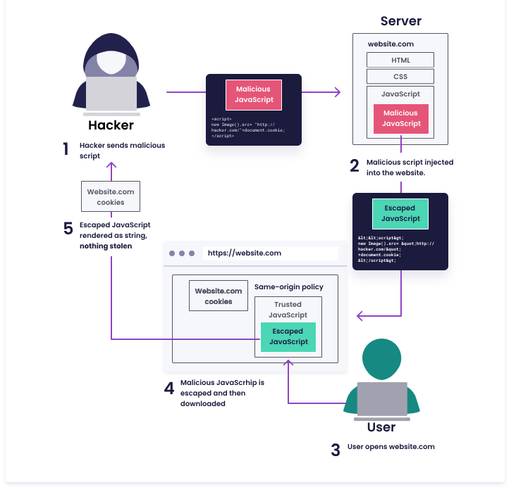

## $\textnormal{(1) Find Place Where User Input Gets Injected into a Response}$

> - XSS is extremely popular for a reason: we programmers <br />
    very often inject user-supplied data into the responses <br />
    we send back to users.

> - The first step to mitigate XSS is to find all places in <br />
    your code where this pattern occurs.

> - Input data might be coming from a database or directly <br />
    from a user request.

> - Any data which might have originated from a user at <br />
    any point in the past is a suspect.

<br />
<br />


## $\textnormal{(2) Escape the Output}$

> - The first and the most important XSS mitigation step <br />
    is to escape your HTML output.

> - To do that, you should HTML-encode all dangerous characters <br />
    in the user-controlled data before injecting that data into <br />
    your HTML output.

> - For example, when HTML-encoded, the character < becomes &lt, <br />
    and the character & becomes &amp etc.

> - This way, the browser will safely handle the HTML-encoded <br />
    characters, i.e. it will not assume they are part of the <br /><
    HTML structure of your page.

> - Remember to encode all dangerous characters.

> - Well proven escape function standard library.

```plaintext
html/template
- https://pkg.go.dev/html/template
```

<br />

| XSS Attack Mitigation |
| --------------------- |
|  |

<br />

```go
import "html/template"

func handleMessageSend(messageId, senderEmail, messageContent string) {
    database.save(messageId, senderEmail, messageContent)
}

func generateMessageHTML(out io.Writer, messageId string) {
    messageContent := database.loadContent(messageId)
    tmpl := template.Must(template.New("example").Parse(`<p class="messageContent">{{.}}</p>`))
    tmpl.Execute(out, messageContent)
}
```

<br />
<br />


## $\textnormal{(3) Perform Input Validation}$

> - Before including user-controlled data in an HTTP response or <br />
    writing it to a database, validate it is in the format you <br />
    expect.

> - Validation functions for many common data types.

```plaintext
https://pkg.go.dev/github.com/asaskevich/govalidator
```

```go
import "html/template"
import "github.com/asaskevich/govalidator"

func handleMessageSend(messageId, senderEmail, messageContent string) {
    if !govalidator.IsEmail(senderEmail) return
    if !govalidator.IsUUID(messageId) return
    database.save(messageId, senderEmail, messageContent)
}

func generateMessageHTML(out io.Writer, messageId string) {
    messageContent := database.loadContent(messageId)
    tmpl := template.Must(template.New("example").Parse(`<p class="messageContent">{{.}}</p>`))
    tmpl.Execute(out, messageContent)
}
```

> - It is mandatory to perform type validation of user input <br />
    before writing it to a database.

> - However, it is also strongly recommended to validate <br />
    data after reading it from the database.

<br />
<br />


## $\textnormal{(4) Don't Input User Input in Dangerous Places}$

> - The above mitigation is effective against situations where <br />
    user input is used as the content of an HTML element <br />
    (e.g. <div> user_input </div> or <p> user_input </p> etc.).

> - Locations where you should never put a user-controlled input.

```plaintext
- Inside the <script> tag
- Inside CSS (e.g. inside the <style> tag)
- Inside an HTML attribute (e.g. <div attr=user_input>)
```

```plaintext
https://cheatsheetseries.owasp.org/cheatsheets/Cross_Site_Scripting_Prevention_Cheat_Sheet.html
```

<br />
<br />


## $\textnormal{Content Security Policy (CSP)}$

> - A `Content Security Policy (CSP)` is a security feature <br />
    implemented by web browsers to mitigate various types of <br />
    web-based attacks, such as cross-site scripting (XSS) <br />
    and data injection attacks.

> - It is a set of directives that a web application can define <br />
    to control which sources of content are considered legitimate <br />
    and safe to load and execute.

> - These sources can include scripts, stylesheets, images, fonts, <br />
    and other types of resources.

> - By specifying the sources of allowed content, CSP instructs <br />
    the browser to only load content from trusted origins and <br />
    domains, thereby blocking any content from untrusted sources.

> - CSP policies are typically defined using a combination of <br />
    content source directives in the HTTP header of the web <br />
    page or within a meta tag in the HTML.

```plaintext
Content-Security-Policy: default-src 'self' https://trusted-site.example;
```

<br />
<br />


## $\textnormal{Keep Learning}$

```plaintext
https://learn.snyk.io/lesson/xss/?loc=learn
https://snyk.io/blog/marked-xss-vulnerability/?loc=learn
https://www.npmjs.com/package/marked
https://snyk.io/series/open-source-security/?loc=learn
```
