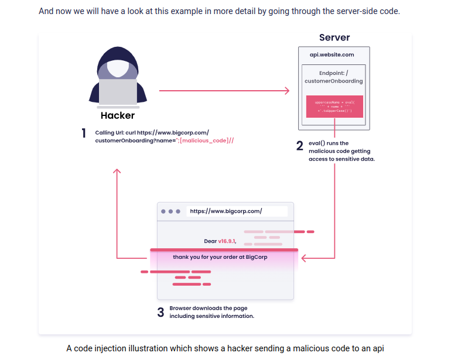

## $\textnormal{How Does Code Injection Work?}$

<br />

| Code Injection Illustration |
| --------------------------- |
|  |

<br />

```typescript
const express = require('express');
const app = express();
const port = 3000;

app.get('/customerOnboarding', (req, res) => {
    // The name req parameter is directly stored without validation.
    const name = req.query.name;
    // The name string is then injected into the eval() function to make string uppercase.
    const uppercaseName = eval('"' + name + '"' + '.toUpperCase()');
    // Result of the eval() is returned to the client.
    res.send('Hi there, ' + uppercaseName);
});

app.listen(port, () => {
    console.log(`Listening on http://localhost:${port}`);
});
```

<br />
<br />


## $\textnormal{Impacts of Code Injection}$

> - The ability to execute server-side code can result in <br />
    total loss of integrity, availability, and confidentiality <br />
    within the application.

> - An attacker may also abuse a code injection vulnerability <br />
    to execute terminal commands on that server and pivot to <br />
    adjacent systems.
