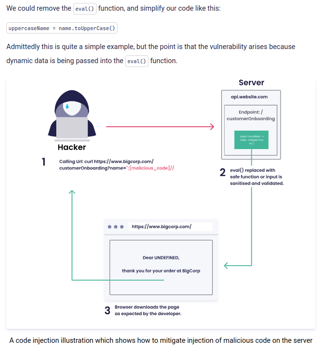

## $\textnormal{Avoid the Use of Dangerous Functions}$

> - In JavaScript, avoid the use of `eval()`, `setTimeout()`, <br />
    `setInterval()` and the Function constructor, especially <br />
    when dealing with user input.

| Code Injection Mitigation |
| ------------------------- |
|  |

<br />
<br />


## $\textnormal{Reconsider the Need for Dynamic Code Execution}$

> - Perhaps the most straightforward of all prevention techniques <br />
    is to reconsider the need to evaluate any dynamically <br />
    generated server-side code.

> - Usually, this dynamic code execution is the result of poor <br />
    software design rather than necessity, so it's always best <br />
    to consider other ways to achieve the task.

<br />
<br />


## $\textnormal{Lock Down the Interpreter}$

> - If the interpreter you are using allows, lock it down by <br />
    limiting the functionality to the minimum amount required <br />
    by your application in the server configuration.

> - If you are using PHP, one method is to use the <br />
    `disable_functions` directive within the `php.ini` file.

<br />
<br />


## $\textnormal{Utilize a Static Analysis Tool}$

> - You can add a static application security testing tool to <br />
    devops pipeline as an additional defense.

```plaintext
https://snyk.io/learn/application-security/static-application-security-testing/?loc=learn
https://snyk.io/product/snyk-code/?loc=learn
```

<br />
<br />


## $\textnormal{Use a Security Linter}$

```plaintext
https://www.npmjs.com/package/eslint-plugin-security-node
```

```json
{
  ...
  "plugins": [
    "security-node"
  ],
  "extends": [
    "plugin:security-node/recommended"
  ]
}
```

> - The plugin contains rules that will test your code for <br />
    vulnerabilities when you run `npm test`.

<br />
<br />


## $\textnormal{Keep Learning}$

```plaintext
https://owasp.org/www-community/attacks/Code_Injection
https://owasp.org/www-community/attacks/Code_Injection
https://snyk.io/blog/command-injection/?loc=learn
```
