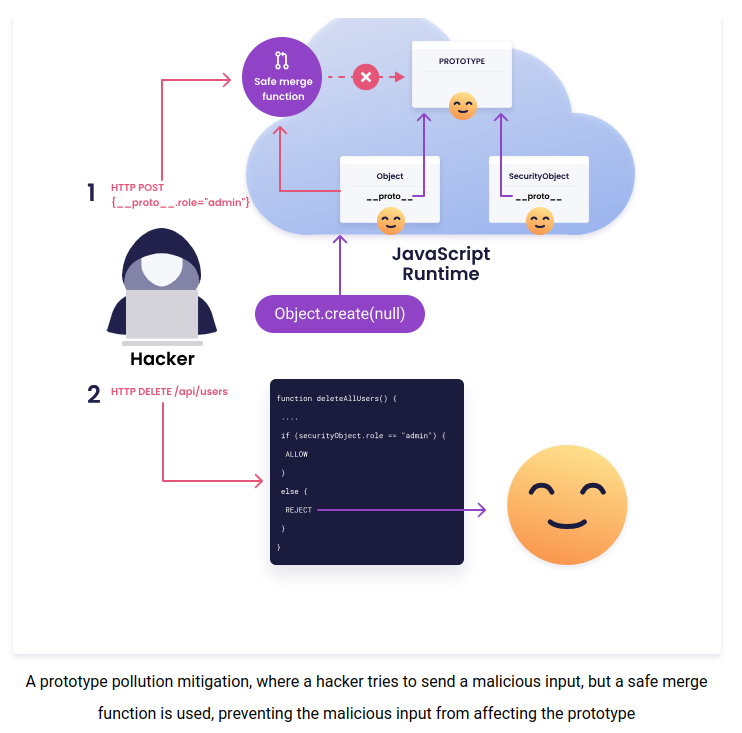
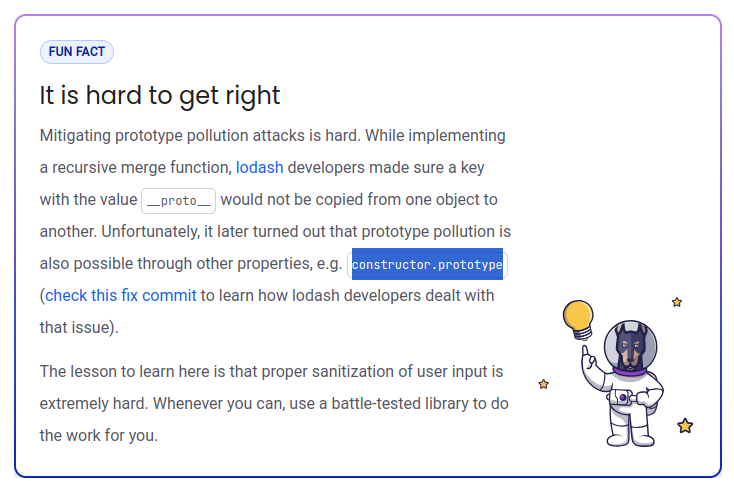

## $\textnormal{Use Safe Open Source Libraries when Recursively Setting Object Properties}$

> - Any function which recursively sets nested properties can <br />
    create an attack vector to expose code to a prototype <br />
    pollution.

```plaintext
- Lodash Clone Deep
    https://lodash.com/docs#cloneDeep

- Lodash Set
    https://lodash.com/docs/4.17.15#set

- Lodash Zip Object Deep
    https://lodash.com/docs/4.17.15#zipObjectDeep
```

| Prototype Mitigation Illustration |
| --------------------------------- |
|  |

<br />

```typescript
import safeMerge from 'lodash.merge';

async function updateUser(userId, requestBody) {
  const userData = await db.loadUserData(userId);
  safeMerge(userData, requestBody);

  await db.saveUserData(userId, userData);
  return userData;
}
```

<br />

```plaintext
https://snyk.io/advisor/?loc=learn
```

<br />

| Fun Fact |
| -------- |
|  |
| Fix Commit: https://github.com/lodash/lodash/pull/4336/files |

<br />
<br />


## $\textnormal{Create New Objects without Prototypes}$

> - Another way to avoid prototype pollution is to consider <br />
    using the `Object.create()` method instead of the object <br />
    literal `{}` or the object constructor `new Object()` <br />
    when creating new objects.

> - This way, we can set the prototype of the created object <br />
    directly via the first argument passed to `Object.create()`.

> - If we pass null, the created object will not have a <br />
    prototype and therefore cannot be polluted.

> - Refere to code [main.js](./code/main.js).

<br />
<br />


## $\textnormal{Prevent any Changes to the Prototype}$

> - JavaScript comes with an `Object.freeze()` method, which <br />
    we can use to prevent any changes to the attributes of <br />
    an object.

> - Since the prototype is just an object, we can freeze it, too.

> - We can freeze the default prototype by invoking <br />
    `Object.freeze(Object.prototype)`, which prevents the <br />
    default prototype from getting polluted.

> - Alternatively, you can install the [nopp](https://www.npmjs.com/package/nopp) npm package <br />
    which freezes all common object prototypes automatically.

```typescript
// call once in ‘main.js’ or similar
Object.freeze(Object.prototype);

async function updateUser(userId, requestBody) {
  const userData = await db.loadUserData(userId);
  merge(userData, requestBody);

  await db.saveUserData(userId, userData);
  return userData;
}
```

<br />
<br />


## $\textnormal{How Do You Mitigate Prototype Pollution?}$

> - To mitigate prototype pollution vulnerabilities in your codebase <br /><
    use popular open-source libraries when you need to recursively <br />
    set nested properties on an object.

> - Check which libraries to use with Snyk Advisor, and always make <br />
    sure that the library you choose is free of vulnerabilities with <br />
    scanners such as Snyk.

```plaintext
https://snyk.io/advisor/?loc=learn
```

> - To harden your code further, use `Object.create(null)` to avoid  <br />
    using prototypes altogether, or use `Object.freeze(Object.prototype)` <br />
    to prevent any changes to the shared prototype.

<br />
<br />


## $\textnormal{Keep Learning}$

```plaintext
https://snyk.io/blog/snyk-research-team-discovers-severe-prototype-pollution-security-vulnerabilities-affecting-all-versions-of-lodash/?loc=learn
https://snyk.io/blog/prototype-pollution-minimist/?loc=learn
https://snyk.io/blog/after-three-years-of-silence-a-new-jquery-prototype-pollution-vulnerability-emerges-once-again/?loc=learn
https://snyk.io/blog/prototype-pollution-in-express-fileupload/?loc=learn
https://github.com/HoLyVieR/prototype-pollution-nsec18/blob/master/paper/JavaScript_prototype_pollution_attack_in_NodeJS.pdf
https://hackerone.com/holyvier?type=user
```
