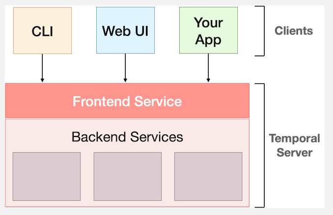
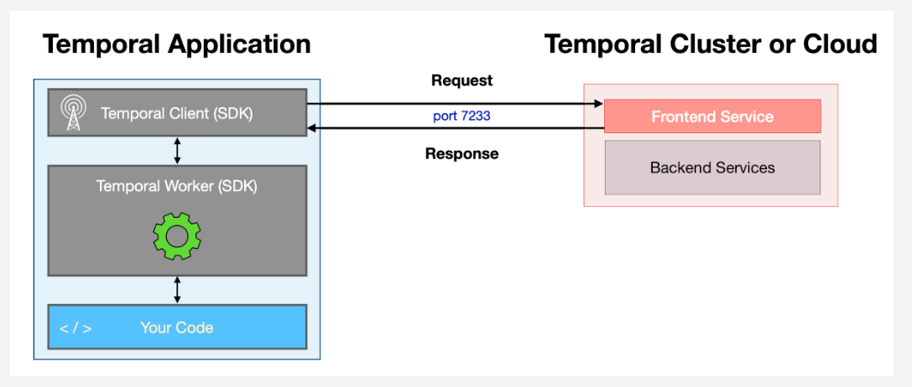
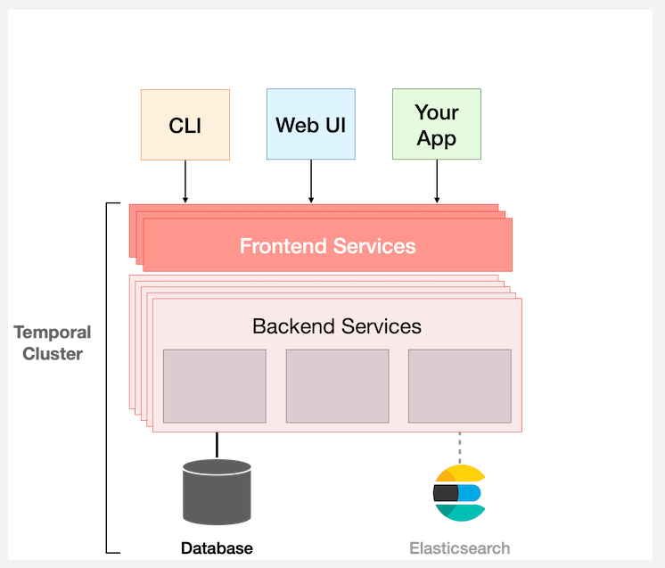
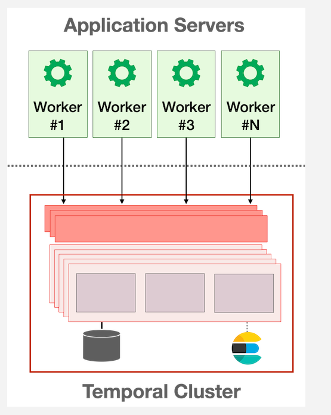

### TEMPORAL SERVER
#
> - You can think of the `Temporal Platform` as having two parts, much like the
    World Wide Web has two parts.



<br />

> - The `Temporal Server` consists of a frontend service, plus several backend
    services that work together to manage the execution of your application code.

> - All of those services are horizontally scalable and a production environment
    will typically run multiple instances of each, deployed across multiple
    machines, to increase performance and availability.

> - You have clients that communicate with the Temporal Server.

> - You'll work with three types of clients in this course:

```plaintext
1. Temporal's command-line interface.
2. Temporal's web-based UI.
3. A Temporal Client embedded into the application you run.
```

> - Note that the frontend service that is part of the Temporal Server acts as an
    API gateway.

> - In other words, it is a frontend for clients, not end users (end users interact
    with the CLI or Web UI).

> - Clients communicate with the Temporal Server by issuing  requests to this
    Frontend Service.

> - The Frontend Service then communicates with backend services, as necessary to
    fulfill the request, and then returns a response to the client.

> - Communication to and within the Cluster is done using `gRPC`, a popular
    high-performancee open source `RPC` framework originally developed by Google and
    now part of the Cloud Native Computing Foundation ecosystem.

> - The messages themselves are encoded using `Protocal Buffers`, an open source
    serialization mechanism also originally developed at Google.



<br />

> - All of this communication can be secured with `TLS`, which encrypts the data as
    it is transmitted across the network and acan also verify the identity of the
    client and server by validating their certificates.

<br />
<br />


### TEMPORAL CLUSTER
#
> - Like the CPU in a computer, the Temporal Server is an essential part of the
    overall system, but requires additional components for operation.

> - The complete system is known as the `Temporal Cluster`, which is a deployment of
    the Temporal Server software on some number of machines, plus the additional
    components used with it.



> - The only required component is a database, such as Apache Cassandra, PostgreSQL,
    or MySQL.

> - The Temporal Cluster tracks the current state of every execution of your Workflows.

> - It also maintains a history of all Events that occur during their executions, which
    it uses to reconstruct the current state in case of failure.

> - It persists this and other information, such as details related to durable timers and
    and queues, to the database.

> - `Elasticsearch` is an optional component.

> - It's not necessary for basic operation, but adding it will give you advanced searching,
    sorting, and filtering capabilities for information about current and recent Workflow
    Executions.

> - This is helpful when you run Worlkflows millions of times and need to locate a specific
    one; for example, based on when it started, how long it took to run, or its final status.

> - Two other tools are often used with Temporal.

```plaintext
Prometheus
    - Used to collect metrics from Temporal.

Grafana
    - Is used to create dashboards based on those metrics.
```

> - Together, these tools help operations teams monitor cluster and application health.

<br />
<br />


### WORKERS
#
> - One thing that people new to Temporal may find surprising is that the Temporal
    Cluster does not execute your code.

> - While the platform guarantees the durable execution of your code, it achieves
    this through `orchestration`.

> - The execution of your application code is external to the cluster, and in
    typical deployments, takes place on a separate set of servers, potentially
    running in a different data center than the Temporal Cluster.

> - The entity responsible for executing your code is known as a `Worker`, and it's
    common to run `Workers` on multiple servers, since this increases both the
    scalability and availability of your application.

> - The `Worker`, which is part of your application, communicates with the Temporal
    Cluster to manager the execution of your Workflows.



<br />

> - The application will contain the code used to initialize the Worker, the Workflow
    and other functions that comprise your business logic, and possibly also code to
    start or check the status of the Workflow.

> - At runtime, you'll need everything needed to execute the application, which will
    include any libraries or other dependencies referenced in your code, on each
    machine where at least one Worker process will run.

<br />
<br />


### WORKER CONNECTIVITY
#
> - Since the Worker uses a Temporal Client to communicate with the Temporal Cluster,
    each machine running a Worker will require connectivity to the Cluster's Frontend
    Service, which listens on TCP port `7233` by default.
