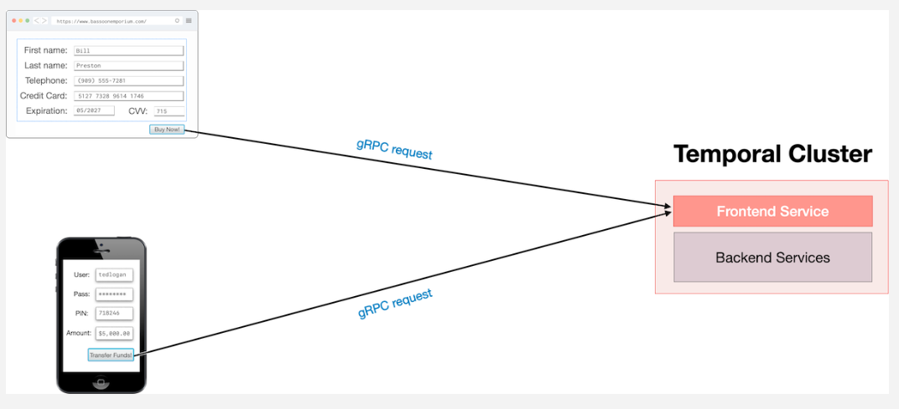
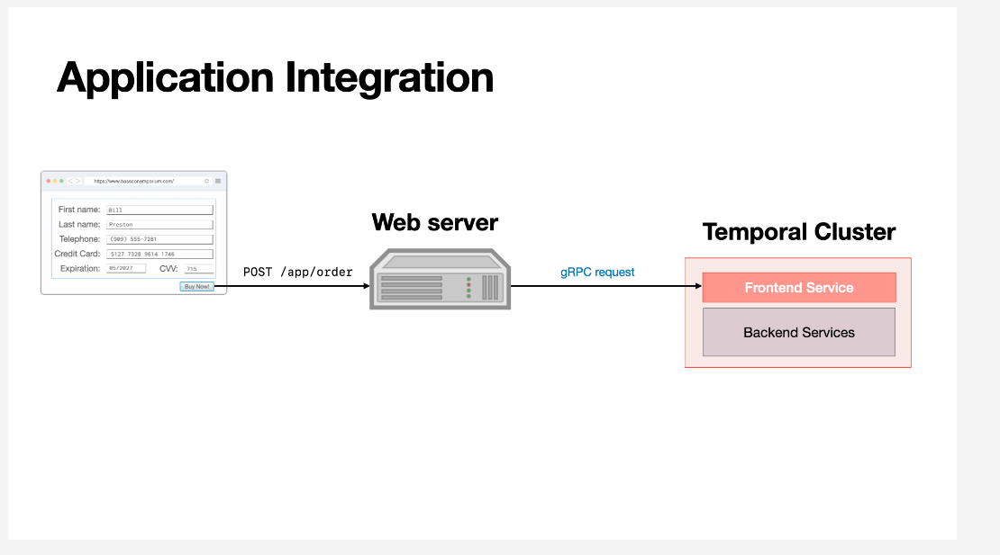

### INTEGRATING TEMPORAL INTO OTHER APPLICATIONS
#
> - In this course, you will primarily interact with the Workflow Executions
    using a command-line interface or through code executed in the terminal.

 
 

### DIRECT INTEGRATION IN APPLICATION FRONTEND
#
> - Is it possible to use a Temporal Client from within those applications.

> - It is also possible to use a Temporal Client from within those applications.

> - It is also possible to issue `gRPC` requests directly from the applications
    without using a Temporal Clientt at all.

 
 

### INTEGRATION THROUGH A BACKEND APPLICATION
> - A more typical approach is to have the end-user application make calls to a
    service, such as a web application that provides a `REST` endpoint, which
    acts as an application gateway and uses a Temporal Client to interact with
    the Cluster.

 

> - The approach above is easier to support from a network security perspective,
    since the Temporal Cluster's Frontend Service only needs to accept inbound
    connections from the Web server instead of having to accept them from every
    end user.
