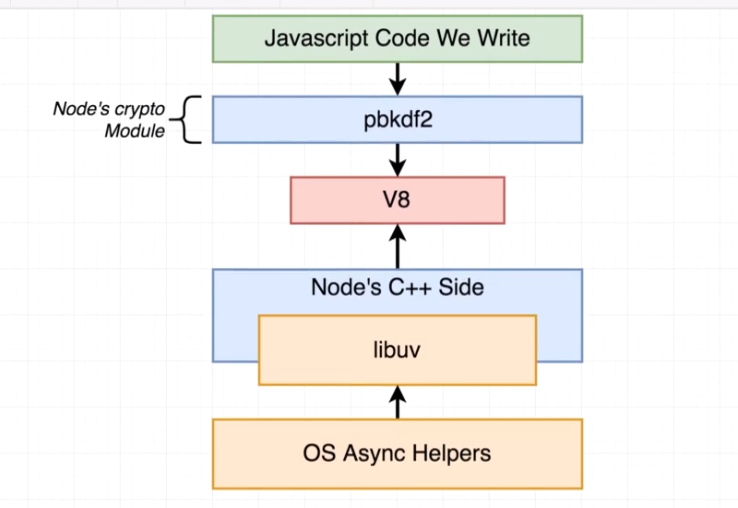

### LIBUV OS DELEGATION
#
> - Refer to the `code-async-2.js` file.

```bash
Operation #7: 249
Operation #2: 253
Operation #4: 257
Operation #1: 261
Operation #5: 264
Operation #3: 266
Operation #6: 269
Total Time: 269
```

> - Based on the result of the `code-async-2.js`, the six tasks all completed
    simultaneously.

<br />



<br />

> - Based on diagram above, `Node.js` has some functions that make use of code
    that is built into the underlying operating system through libuv.

> - Libuv sees that were attempting to make an HTTP request. Neither libuv nor
    Node has any code to handle all of the super low level operations that are
    involved with a network request.

> - Instead `libuv` delegates the request-making to the underlying operating system.

> - Its our operating system that does the real HTTP request. `Libuv` is used
    to issue request and then it just waits on the operating system to emit a
    signal that some response has come back to the request.

> - The operating system itself decides whether to make a new thread or not, or
    just generally how to handle the entire process of making a requst.

> - Since operating system is making the request, there is no blocking of our
    JavaScript code inside of our event loop, or anything else in our application.

> - Thread pool are not involved in this case.
