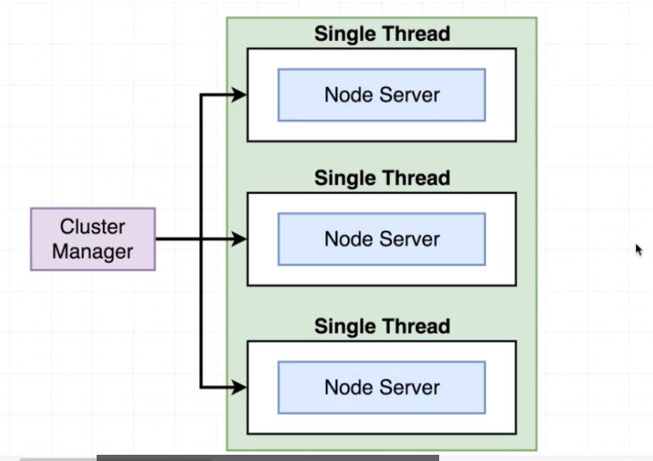
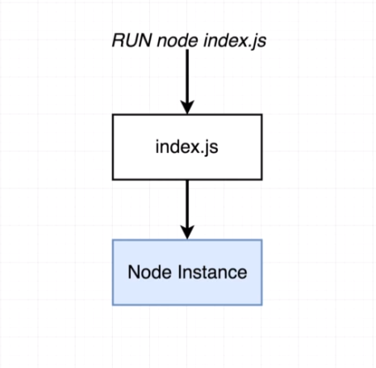
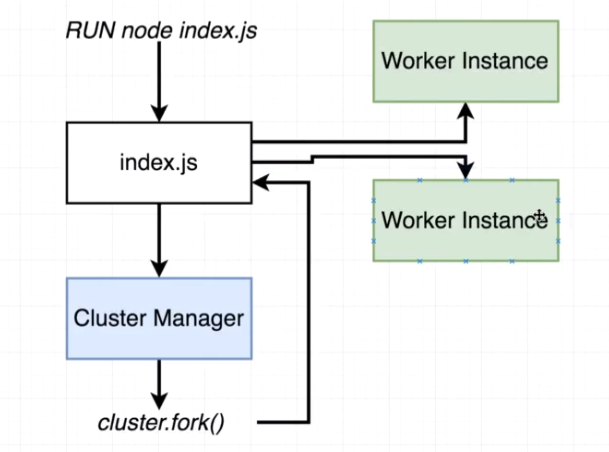

### Clustering Manager
#

 

 

> - When starting a clustering in application, it means starting
    up multiple node processes.

> - There's always going to be one parent process or one kind of
    like overarching process called the `cluster manager`.

> - The `cluster manager` is responsible for monitoring the health
    of individual instances of our application that we're gonna
    launch at the same time on our computer.

> - All those node server in the diagram above are instances of
    our application that are running on our singular computer.

> - These are not being spread out to multiple machines.

> - Its multiple intances, one computer.

> - `Cluster Manager` doesn't actually execute any application code.

> - `Cluster Manager` is not responsible for handling incoming
    requests or fetching data from the database.

> - `Cluster Manager` is responsible for monitoring the health of
    each of the individual instances.

> - `Cluster Manager` can start instances, it can stop them, it can
    restart them, it could send them data, it can do other kind of
    like administrative tasks essentially, but it's still going to
    be up to these individual instances of our server to actually
    process incoming requests and do things like say access the
    database, or handle authentication, or serve up static files.

 

 

> - Above is a usual node application from the terminal (not a
    clustering).

> - Example, when running the `code-index.js` node takes the contents
    of that file, it executes it, and then starts up the event loop.

> - So we get a single node instance out of that entire process and
    it's a very linear process.

 

 

> - Based on the diagram above, the first instance of node that gets
    launched is the `cluster manager`.

> - `Cluster Manager` is responsible for starting up worker instances.

> - The `Worker` instances are what actually responsible for processing
    those incoming requests.

> - To create these worker instances the cluster manager is going to
    require in the `cluster module` from the node standard library.

> - `Fork` is a particular function in cluster module, that whenever we
    call that fork function from within the cluster manager something
    very interesting happens.

> - When you call `fork` node internally goes back to the `index.js` file
    and it executes it a second time, but it executes it a second time,
    but it executes that second time in a slightly different mode, which
    then starts up the worker instance.

> - You can imagine the `index.js` will be executed multiple times by Node.

> - The first execution is the cluster manager, and every execution after
    that are the worker instances.
